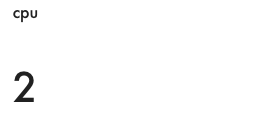
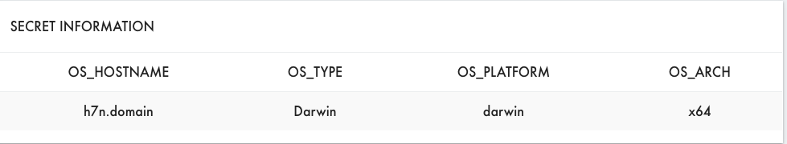

# MatrixOS Config Widget examples

# Layout

```
screens:
  - - cpu
    - memory
```

# Displays

## Value

```
cpu:
  type: monitor
  key: cpu
  display: digit
  format: round
  label: cpu
```

## Bar Chart

```
barChart:
  type: monitor
  keys: cpu, memory
  display: bar
  label: Bar Chart
```

## Radar Chart

```
radarTest:
  type: monitor
  keys: cpu,memory
  display: radar
  label: radarTest
```

## Line Chart

```
cpuChart:
  type: monitor
  keys: cpu,memory
  display: line
  label: CPU Chart
```

## List

```
info:
  type: device
  display: list
  label: Secret Information
```

## List Group

### Simple Group

```
info:
  type: device
  keys: count
  display: list-group
  format: count
  label: Total
```

### Group by Key

```
info:
  type: device
  keys: zone, count
  groupby: zone
  format: count
  display: list-group
  label: Total
```

# Interactive

## Buttons

### Single

```
buttonTest:
  label: Hacking Buttons
  control: button
  event: buttonInfo
  value: Get Secret Information
```
###### Handling Code
```
matrix.on('buttonInfo', function(){
  // ...
})
```
`event` in the config file, is the event name (`buttonInfo`) handled.


### Map Notation
Multiple events are supported in a widget through the use of the `map` property.

This has two valid expressions. Key / Value and Collection

#### Simple Form - Key, Value
```
buttons:
  control: button
  map:
    'label' : eventName
    'label2': event2Name
```


#### Simple Form - mapSort
Use `order` to display buttons in a particular order.

```
map:
  'label' : eventName
  'label2': event2Name
order:
  - 'label'
  - 'label2'
```

#### Normal Form - Multiple
```
buttons:
  control: button
  map:
   - value: seven
     event: event7
   - value: eight
     event: event8
   - value: nine
     event: event9
```

#### Normal Form Overview
```
map:
  - value: foo    # button label
    event: e     # event name emitted for app to listen for
    <!-- data: 1      # what data to send with this button -->
    <!-- color: 'red' # what color to tint this button -->
```

### Multiple

```
buttonsTest:
  label: Matrix Activation Buttons
  control: button
  map:
    'amps+': buttonUp
    'amps-': buttonDown
    begin : buttonStart
    end : buttonStop
    capture : buttonSample
    'refresh+' : buttonSlow
    'refresh-' : buttonFast
```
###### Handling Code
```
 matrix.on('buttonStop', function(){
   //...
})

 matrix.on('buttonStart', function(){
   //...
 })

 matrix.on('buttonSample', function () {
   //...
 })
```
## Drop Downs

```
dropDown:
  control: dropdown
  map:
    test1: doTest1
    test2: doTest2
  label: dropdown test
```
Simple form and normal form from above also work for drop downs.

###### Handling Code
```
matrix.on('doTest1', function(){
 //...
})


matrix.on('doTest2', function(){
 //...
})
```

## Range
```
control: range
min: 0
max: 255
event: setRange
```

###### Handling Data
To group your apps

# Responsive Data Flow
```
matrix.on('buttonInfo', function(){
  matrix.type('device').send({
    'os_hostname': os.hostname(),
    'os_type': os.type(),
    'os_platform': os.platform(),
    'os_arch': os.arch()
  });
})
```
When `buttonInfo` is triggered, respond with information with a type `device`.

The list looks for
```
widgets:
  list:
    type: device
```
The `list` widget displays information of type `device`.
