# MatrixOS Widget examples

There are many "general setting" to make the configuration for the widgets. Here we show you the most common use for each of them. 

Remember that there are other "optional settings" that can be added for more specific things like Data handling (refresh time), Data format and size. You can refer to [Widgets](widgets.md) for a better explanation on this subjects.

# Displays

## Digit

```
digitTest:
  display: digit
  type: monitor
  key: cpu
  format: round
  label: cpu
```

###### Handling Code
```
matrix.type('monitor').send({
  'cpu': 2.4,
  'memory': 5.4 }
);  
```

## Label
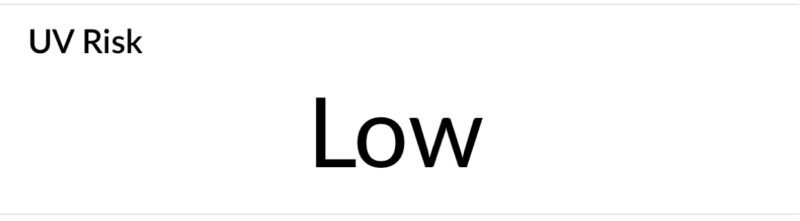
```
labelTest:
  display: label
  type: uv
  key: risk
  label: UV Risk
```

###### Handling Code
```
matrix.type('uv').send({
  'value': 0.56773,
  'risk': 'Low' }
);  
```

## Bar Chart

```
barChartTest:
  display: bar
  type: monitor
  keys: cpu, memory
  format: avg
  realtime: false
  refresh: 60
  label: Bar Chart
```

###### Handling Code
```
matrix.type('monitor').send({
  'cpu': 7.03,
  'memory': 2.30 }
);  
```

## Line Chart
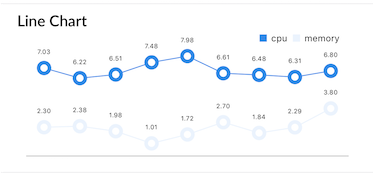
```
lineChartTest:
  display: line
  type: monitor
  format: avg
  keys: cpu, memory
  realtime: true
  label: Line Chart
```

###### Handling Code
```
matrix.type('monitor').send({
  'cpu': 7.03,
  'memory': 2.30 }
);  
```

## Radar Chart
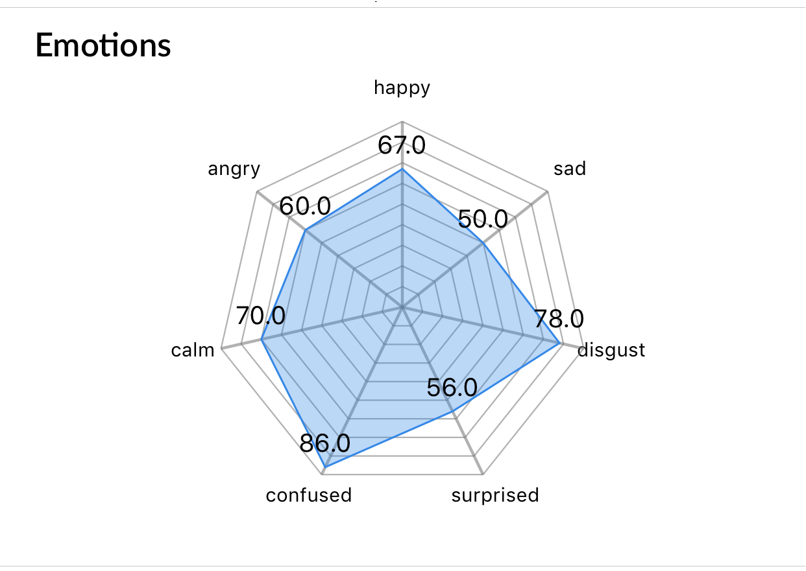
```
radarTest:
  display: radar
  type: emotions
  keys: happy,sad,disgust,surprised,confused,calm,angry
  label: Emotions
```

###### Handling Code
```
matrix.type('emotions').send({
  'happy': 67,
  'sad': 50,
  'disgust': 78,
  'surprised': 56,
  'confused': 86,
  'calm': 70,
  'angry': 60 }
);  
```

## Pie Chart
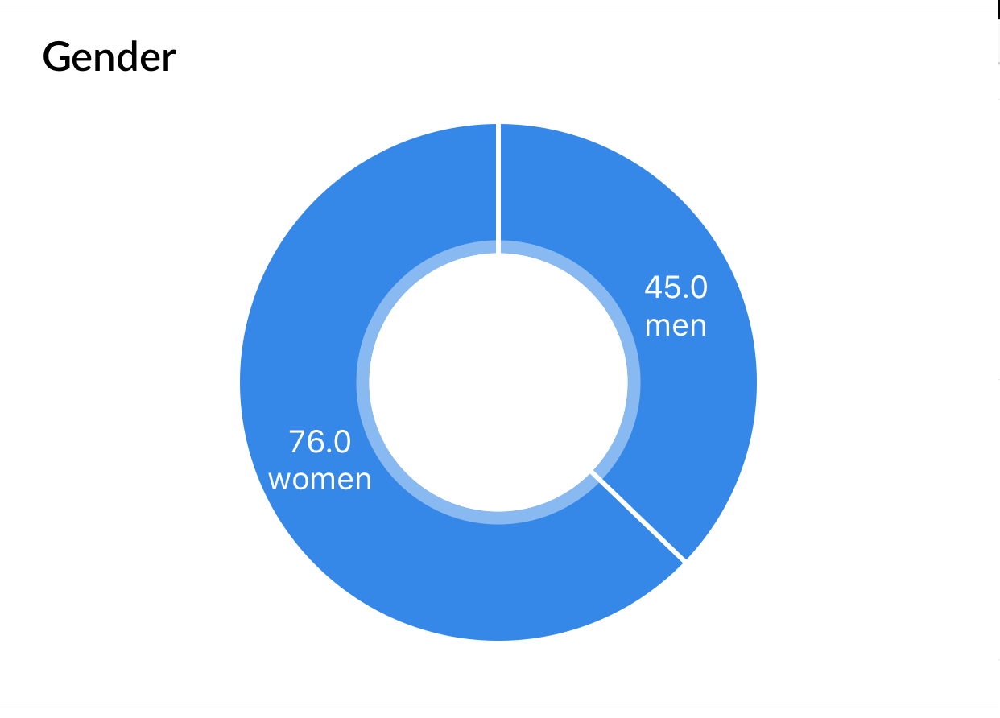
```
pieChartTest:
  display: pie-chart
  type: gender
  keys: women,men
  label: Gender
```

###### Handling Code
```
matrix.type('gender').send({
  'women': 76,
  'men': 45 }
);  
```

## Polar Chart
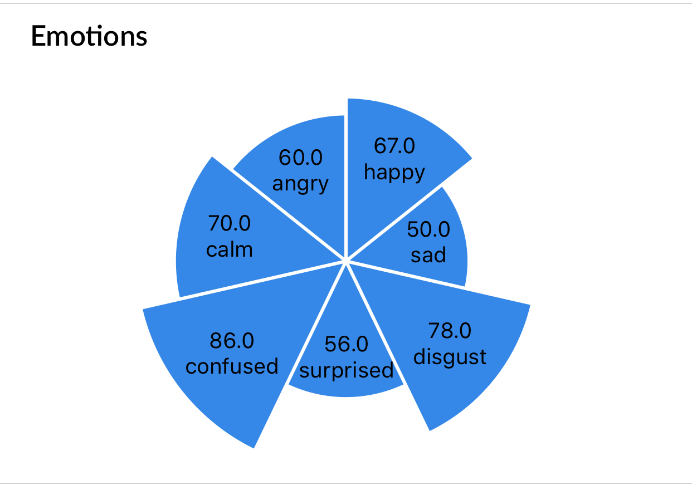
```
polarTest:
  display: polar
  type: emotions
  keys: happy,sad,disgust,surprised,confused,calm,angry
  label: Emotions
```

###### Handling Code
```
matrix.type('emotions').send({
  'happy': 67,
  'sad': 50,
  'disgust': 78,
  'surprised': 56,
  'confused': 86,
  'calm': 70,
  'angry': 60 }
);  
```

## Gauge
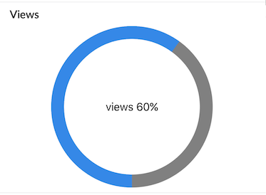
```
gaugeTest:
  display: gauge
  type: detection
  keys: views
  min: 0
  max: 100
  label: 'Views'
```

###### Handling Code
```
matrix.type('detection').send({
  'views': 60,
  'impressions': 100 }
);  
```

## Indicator
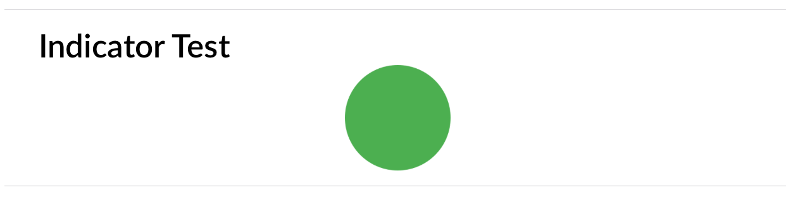
```
indicatorTest:
  display: indicator
  type: system
  keys: isOn
  label: 'Indicator Test'
```

###### Handling Code
```
matrix.type('system').send({
  'isOn': true}
);  
```

## Map
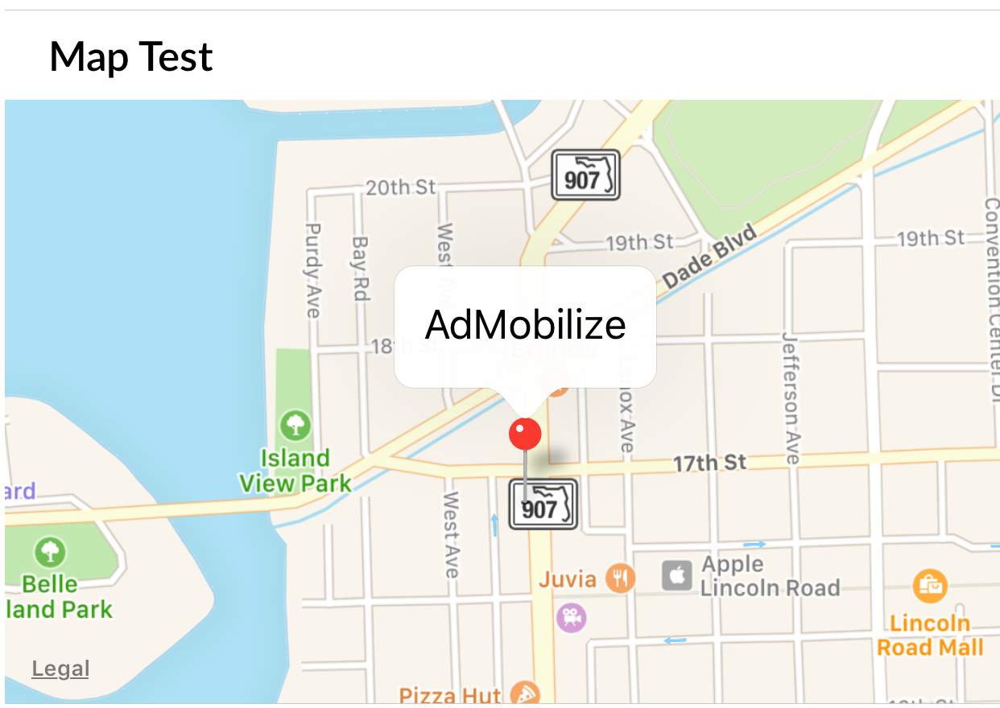
```
mapTest:
  display: map
  type: location
  label: 'Map Test'
```

###### Handling Code
```
matrix.type('location').send({
  'latitude': 25.791632,
  'longitude': -80.1414447,
  'label': 'AdMobilize'}
);  
```

## Lists

```
listTest:
  display: list
  type: device
  keys: Hostname,Type,Platform,Arch
  label: Secret Information
```

###### Handling Code
```
matrix.type('device').send({
  'Hostname': 'h7n.domain',
  'Type': 'Darwin',
  'Platform': 'darwin',
  'Arch': 'x64'}
);  
```

## List Group

### Simple Group
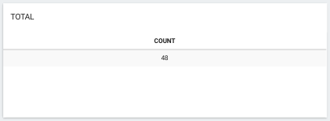
```
info:
  display: list-group
  type: vehicleDetection
  keys: count
  format: count
  label: Total
```

###### Handling Code
```
matrix.type('vehicleDetection').send({
  'zoneId': 'zone1',
  'count': '4',
  'speed': '56'}
);  
```

### Group by Key
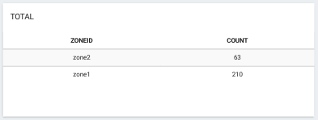
```
info:
  display: list-group
  type: device
  keys: zone, count
  format: count
  groupby: zone
  label: Total
```

###### Handling Code
```
matrix.type('vehicleDetection').send({
  'zoneId': 'zone1',
  'count': '4',
  'speed': '56'}
);  
```

## Links

```
link:
  display: link
  label: "Link display"
  title: "Google"
  url: "https://www.google.com"
```

# Interactive (Controls)

## Input
### Single


```
  inputTest:
    control: input
    event: testInput
    value: 'type text'
    label: 'Test Input'
```

###### Handling Code
```
matrix.on('testInput', function(p){
 var text = p.value;
})
```

### Multiple


```
  inputMapTest:
    control: input
    map:
      - event: testInput1
        value: first type text
      - event: testInput2
        value: second type text
    label: Test Input Map
```

###### Handling Code
```
matrix.on('testInput1', function(p){
 var text = p.value;
})

matrix.on('testInput2', function(p){
 var text = p.value;
})

```

## Buttons

### Single
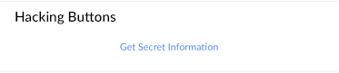

```
  buttonTest:
    control: button
    event: buttonInfo
    value: Get Secret Information
    label: Hacking Buttons
```

###### Handling Code
```
matrix.on('buttonInfo', function(){
  // ...
})
```

### Multiple
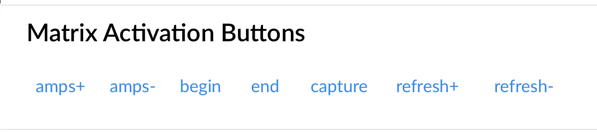

```
  buttonMapTest:
    control: button
    map:
      - event: buttonUp
        value: amps+
      - event: buttonDown
        value: amps-
      - event: buttonStart
        value: begin
      - event: buttonStop
        value: end
      - event: buttonCapture
        value: capture
      - event: buttonSlow
        value: refresh+
      - event: buttonFast
        value: refresh-
    label: Matrix Activation Buttons
```

###### Handling Code
```
matrix.on('buttonUp', function(){
  // ...
})

matrix.on('buttonDown', function(){
  // ...
})

matrix.on('buttonStart', function(){
  // ...
})

matrix.on('buttonStop', function(){
  // ...
})

matrix.on('buttonCapture', function(){
  // ...
})

matrix.on('buttonSlow', function(){
  // ...
})

matrix.on('buttonFast', function(){
  // ...
})
```

## Switch

### Single

```
  switchTest:
    control: switch
    event: ledEnabledChanged
    value: Leds enabled
    label: Switch Test
```

###### Handling Code
```
matrix.on('ledEnabledChanged', function(p){
 var isOn = p.value;
})
```

### Multiple
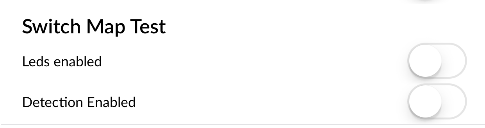
```
  switchMapTest:
    control: switch
    map:
      - event: ledEnabledChanged
        value: Leds enabled
      - event: detectionEnabledChanged
        value: Detection Enabled
    label: Switch Map Test
```

###### Handling Code
```
matrix.on('ledEnabledChanged', function(p){
 var isOn = p.value;
})

matrix.on('detectionEnabledChanged', function(p){
 var isOn = p.value;
})
```

## Radio
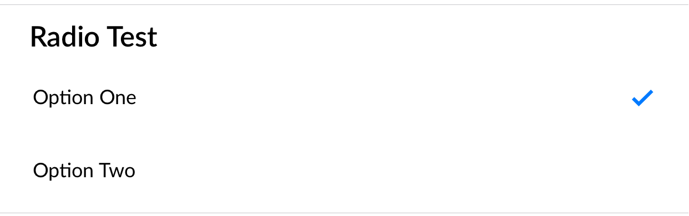
```
  radioTest:
    control: radio
    map:
      - event: optionOneSelected
        value: Option One
      - event: optionTwoSelected
        value: Option Two
    label: Radio Test
```

###### Handling Code
```
matrix.on('optionOneSelected', function(p){
  // ...
})

matrix.on('optionTwoSelected', function(p){
  // ...
})
```

## Drop Downs
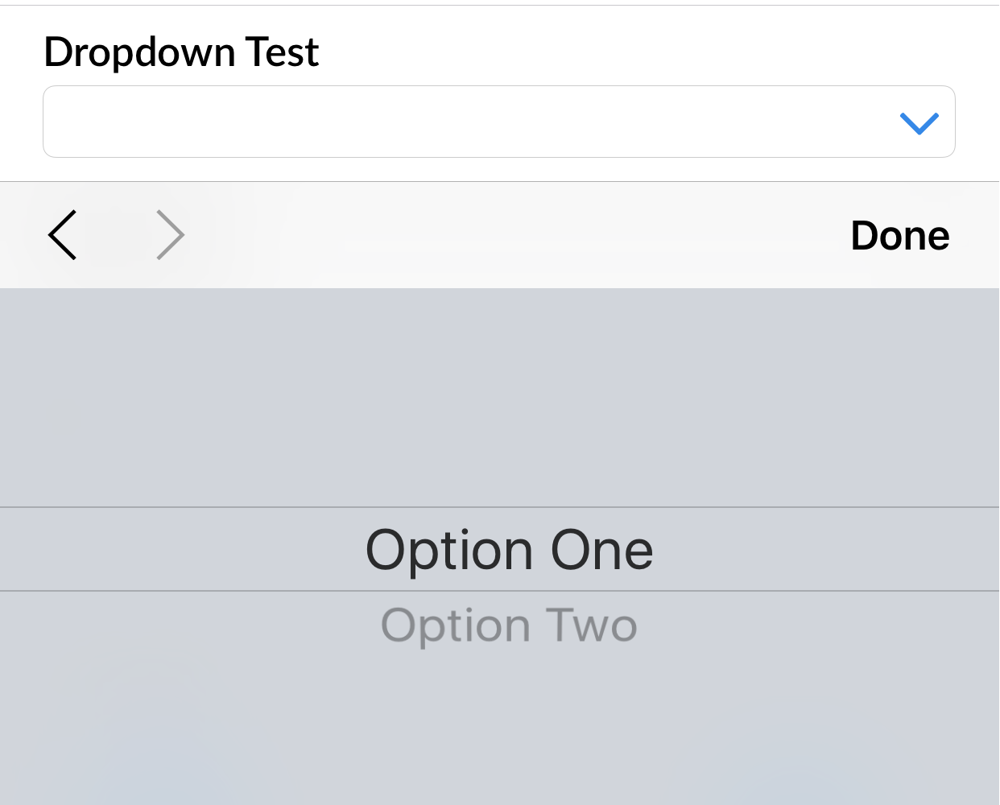
```
  dropDownTest:
    control: dropdown
    map:
      - event: optionOneSelected
        value: Option One
      - event: optionTwoSelected
        value: Option Two
    label: Dropdown Test
```

###### Handling Code
```
matrix.on('optionOneSelected', function(){
 //...
})

matrix.on('optionTwoSelected', function(){
 //...
})
```

## Range

```
  rangeTest:
    control: range
    event: rangeChanged
    min: 0
    max: 35
    label: Range Test
```

###### Handling Code
```
matrix.on('rangeChanged', function(p){
 var value = p.value;
})
```

## XY
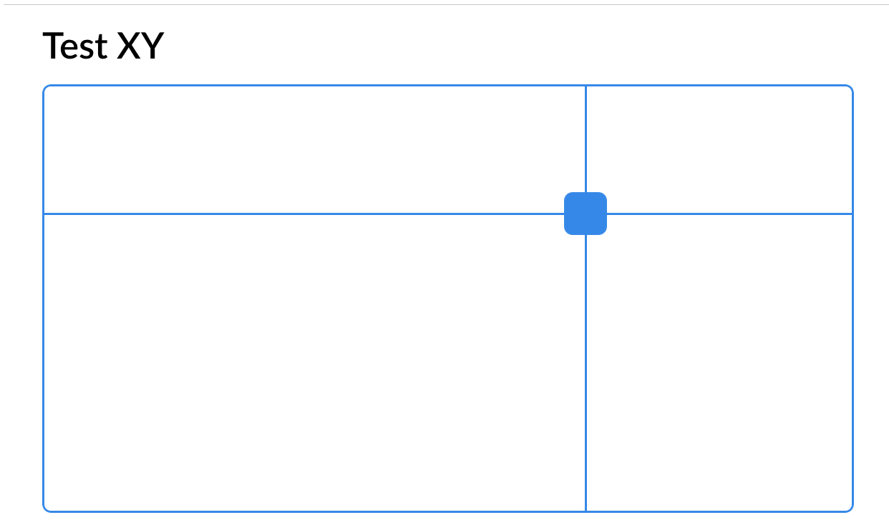
```
  xyTest:
    control: xy
    event: xyChanging
    value: 'xy'
    xMax: 100
    yMax: 50
    label: Test XY
```

###### Handling Code
```
matrix.on('xyChanging', function(p){
 var x = p.value.x;
 var y = p.value.y;
})
```

## Radial
### Single
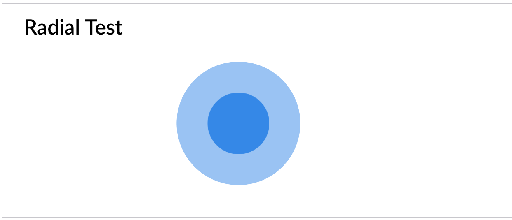

```
  radial:
    control: radial
    event: radialChanging
    label: Radial Test
```

###### Handling Code
```
matrix.on('radialChanging', function(p){
 var x = p.value.x; //from -1 to 1
 var y = p.value.y; //from -1 to 1
})
```

### Multiple
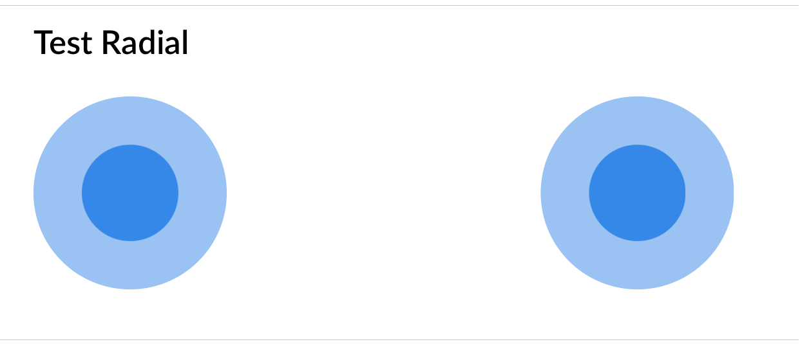

```
  radialMap:
    control: radial
    map:
    - event: radialRChanging
      value: right
    - event: radialLChanging
      value: left
    label: Radial Map Test
```

###### Handling Code
```
matrix.on('radialRChanging', function(p){
 var x = p.value.x; //from -1 to 1
 var y = p.value.y; //from -1 to 1
})

matrix.on('radialLChanging', function(p){
 var x = p.value.x; //from -1 to 1
 var y = p.value.y; //from -1 to 1
})
```

## Color
  
```
  color:
    control: color
    event: colorChange
    value: 'color'
    label: 'Change MATRIX color'
```

###### Handling Code
```
matrix.on('colorChange', function(color){
  color = color.value;
  if(!isRgbColor(color)){
    color = hexRgb(color);
    color = 'rgb(' + color[0] + ','+ color[1] + ',' + color [2] + ')';
  }

  everloopColor = color;
  renderLeds(everloopColor);
});
```

# Responsive Data Flow
```
matrix.on('buttonInfo', function(){
  matrix.type('device').send({
    'os_hostname': os.hostname(),
    'os_type': os.type(),
    'os_platform': os.platform(),
    'os_arch': os.arch()
  });
})
```
When `buttonInfo` is triggered, respond with information with a type `device`.

The list looks for
```
widgets:
  list:
    type: device
```
The `list` widget displays information of type `device`.
