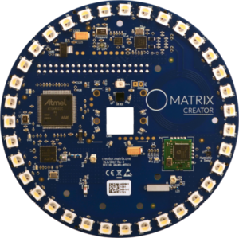

# MATRIX Ecosystem Overview
<h5 style="padding-top:0; font-weight:500;">Objective: Hardware shouldn't be hard</h5>
The MATRIX Ecosystem was created to make powerful hardware projects very approachable for software developers. The pillars of MATRIX, computer vision, hardware interfaces, distributed internet communication, and data-driven end-user clients, are all programming disciplines which require years for an individual to master, or for a team to build a solution around.

## Programming Layers

The MATRIX platform adds powerful capabilities to your Raspberry Pi, depending on your background and the kind of application you want to write, you may need to decide on which layer best fits your need. The documentation is organized according to these layers:

<!-- <h3 style="font-weight:400; padding-top:0;">MATRIX Open System</h3> (Javascript) -->
<h3 style="padding-top:0; font-weight:500;">MATRIX Open System (MOS)</h3>
**Language:** Javascript

Highest level of abstraction integrating with MATRIX hardware via **MATRIX CORE**. This layer requires an online connection and offers an integrated IoT environment that's easy to use.

* Remote App Deployment
* Mobile Interface
* Online Dashboard
* App Store

[Read more about MATRIX OS](matrix-os/overview/)

<h3 style="padding-top:0; font-weight:500;">MATRIX CORE</h3>
**Languages:** Over 40 (Examples in Javascript & Python)

Abstraction layer for **MATRIX HAL**. Hosts a ZeroMQ + Protobuf communication layer which makes device information accessible via high-level interfaces. Supports 40+ different languages through Protocol Buffers: C++, Python, Ruby, PHP, Java, etc. 

[Read more about MATRIX CORE](matrix-core/index.md)

<h3 style="padding-top:0; font-weight:500;">MATRIX HAL</h3>
**Language:** C++

Interacts with the kernel modules by using C++ drivers, enabling it to access available sensors and components on your device.

[Read more about MATRIX HAL](matrix-hal/index.md)

## Devices
> Each programming layer in the MATRIX platform is compatible with each MATRIX product, excluding specific components on the boards.

<h3 style="padding-top:0; font-weight:500;">MATRIX Creator</h3>

<!--  -->
A fully-featured development board for the Raspberry Pi with various sensors and communication protocols such as a 3D Gyroscope, Accelerometer, an 8 Microphone Array, zigbee, Z-Wave, and more!

[Read more about the MATRIX Creator](matrix-creator/overview.md)

<h3 style="padding-top:0; font-weight:500;">MATRIX Voice</h3>
<!--  -->
A voice and audio focused development board with an 8 microphone array that enables you to create your own audio driven applications or use voice assistants such as 
<a href="https://www.hackster.io/matrix-labs/matrix-voice-and-matrix-creator-running-alexa-c-version-9b9d8d" target="_blank">Amazon Alexa</a>, 
<a href="https://www.hackster.io/matrix-labs/matrix-voice-and-matrix-creator-running-google-assistant-e9751e" target="_blank">Google Assistant</a>, 
PocketSphinx, etc.

[Read more about the MATRIX Voice](matrix-voice/overview.md)

## Support
* Post questions or comments on <a href="https://community.matrix.one" target="_blank">community.matrix.one</a>
* Alert issues on our <a href="https://github.com/matrix-io" target="_blank">GitHub</a> under the corresponding repository
* Submit documentation issues or improvements to the <a href="https://github.com/matrix-io/matrix-documentation/issues" target="_blank">MATRIX Documentation Repository</a>

