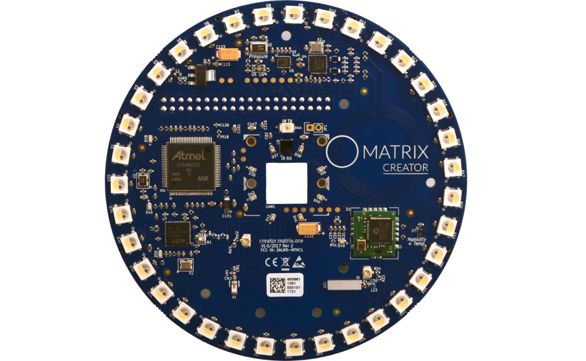

## MATRIX Creator

The MATRIX Creator is a fully-featured development board, including sensors, wireless communications, and an FPGA. MATRIX Creator was built with a mission to give every maker, tinkerer, and developer around the world a complete, affordable, and user-friendly tool for simple to complex Internet of Things (IoT) app creation.

## Overview

- [Device Setup](/matrix-creator/device-setup/): How to get started with your MATRIX Creator
- [Resources](/matrix-creator/resources/overview/): View and download helpful information about the MATRIX Creator