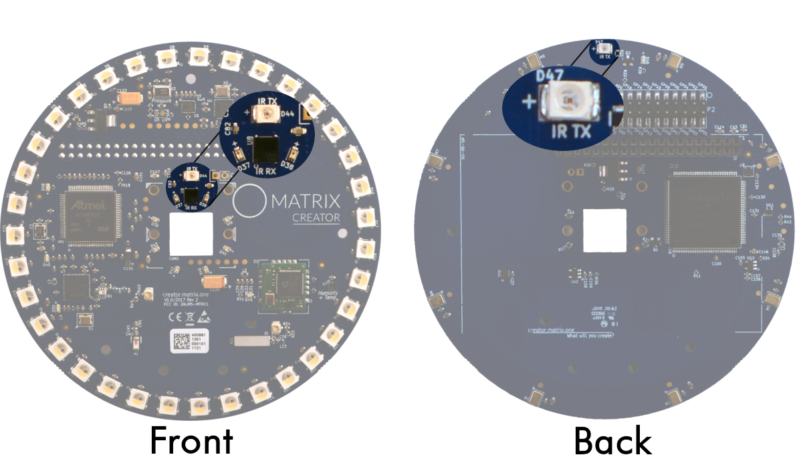

## IR on MATRIX Creator

## Overview
There are two IR transmitters and one IR receiver on the MATRIX Creator. Both components are wired to the [Pi's GPIO pins](http://127.0.0.1:8000/matrix-creator/resources/pinout/#raspberry-pi-gpio) for you to directly call.

!!! info "IR Transmitters"
    **Raspberry Pi** `GPIO BCM Pin: 13` 
    Both transmitters are located on the front & back of the MATRIX Creator. They are both connected to the same pin.

!!! info "IR Receiver"
    **Raspberry Pi** `GPIO BCM Pin: 16` 
    The receiver is located on the front of the MATRIX Creator.

## Usage
The IR components on the MATRIX Creator should work the same as if they were directly placed on a Raspberry Pi. This means that libraries which utilize IR components can work with the MATRIX Creator. Below are a few we've seen work.

!!! example "pigpio"
    The 
    <a target="_blank" href="http://abyz.me.uk/rpi/pigpio/pigpiod.html">pigpio library</a> 
    has an example that can record and send IR signals you want to record. However, the implementation will cause issues with using audio recording/playback.

    Example Repositories:

    - <a target="_blank" href="https://github.com/matrix-io/matrix-creator-ir-test">IR Test</a>: Simple record & playback of an IR signal.
    - <a target="_blank" href="https://github.com/matrix-io/MATRIX-TV-Remote-Website">TV Remote Website</a>: Website that can command the MATRIX Creator to send IR signals. 

!!! example "LIRC"
    The 
    <a target="_blank" href="http://www.lirc.org/">LIRC Package</a> 
    allows for receiving and sending IR signals with common IR remotes. Unlike pigpio, this package seems to play well with audio recording/playback.
    
    !!! bug "Kernel 4.19 workaround"
        To utilize LIRC on the latest Kernel modules for Raspbian Stretch, A patch needs to be applied for the package. 
        <a target="_blank" href="https://www.raspberrypi.org/forums/viewtopic.php?t=235256">These community contributed instructions</a> 
        can help solve this issue.