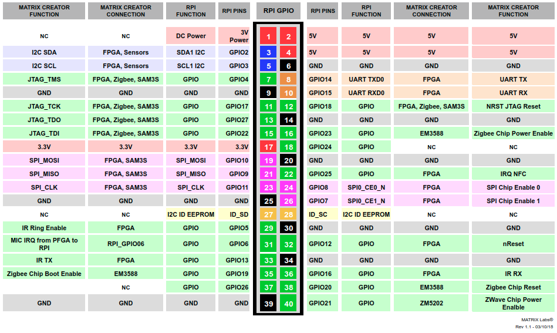
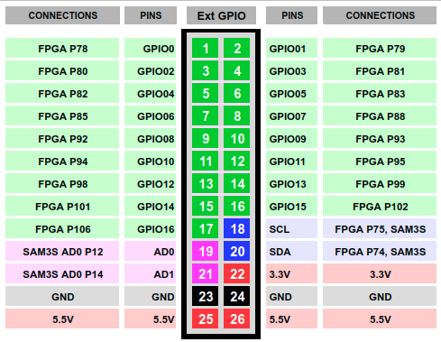

### MATRIX Creator

MATRIX Creator is a fully-featured development board, including microphones, sensors, wireless communications, an ARM Cortex M3 processor and a Spartan 6 FPGA. MATRIX Creator was built with a mission to give every maker, tinkerer, and developer around the world a complete, affordable, and user-friendly tool for simple to complex Internet of Things (IoT) app creation.

#### Board

##### Top View

##### Bottom View

### 3D Model
Access to 3D models [here](https://github.com/matrix-io/matrixio-models/tree/master/matrix-creator).

#### System Architecture

#### Raspberry Pi GPIO pinout

#### External GPIO pinout

#### Technical Datasheets:

* [Atmel 32 bits Cortex M3 SAM3S2](http://www.atmel.com/Images/Atmel-6500-32-bit-Cortex-M3-Microcontroller-SAM3S4-SAM3S2-SAM3S1_Datasheet.pdf)

* [Xilinx Spartan 6S XC6SLX4 FPGA](http://www.xilinx.com/support/documentation/data_sheets/ds160.pdf)

* [8 MEMS audio sensor digital microphones](https://www1.iodparts.com/datasheets/stmicroelectronics-microphones-dm00111225.pdf)

* [ST LSM9DS1 3D accelerometer, 3D gyroscope, 3D magnetometer](http://www.st.com/content/ccc/resource/technical/document/datasheet/1e/3f/2a/d6/25/eb/48/46/DM00103319.pdf/files/DM00103319.pdf/jcr:content/translations/en.DM00103319.pdf)

* [ST HTS221 digital sensor for relative humidity and temperature](http://www.st.com/content/ccc/resource/technical/document/datasheet/4d/9a/9c/ad/25/07/42/34/DM00116291.pdf/files/DM00116291.pdf/jcr:content/translations/en.DM00116291.pdf)

* [NXP PN512 NFC reader](https://www.nxp.com/documents/data_sheet/PN512.pdf)

* [NXP MPL3115A2 Altimeter](http://cache.freescale.com/files/sensors/doc/data_sheet/MPL3115A2.pdf)

* [Vishay VEML6070 UV Light Sensor](http://www.vishay.com/docs/84277/veml6070.pdf)

* [Vishay INFRARED Receptor](http://www.vishay.com/docs/82450/tsop573.pdf)

* [RGBW everloop LED](http://blinkinlabs.com/wp-content/uploads/2016/01/SK6812RGBW-datasheet.pdf)
