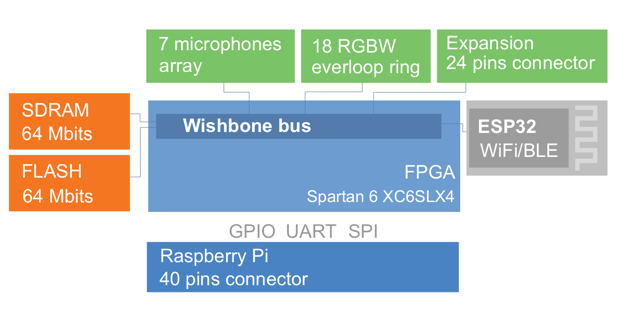

# MATRIX Voice

MATRIX Voice is an open-source VOICE RECOGNITION platform consisting of a 3.14-inches in diameter dev board, with a radial array of 7 MEMS microphones connected to a Xilinx Spartan6 FPGA & 64 Mbit SDRAM with 18 RGBW LED’s & 64 GPIO pins. 

## System Architecture

## Harware Integrations
- [FPGA](../components/fpga.md)
- [HAL](../getting-started/hello-world.md)
- [Microphone](../Hardware/microphone.md)

## Example Software Integrations
- [CORE](../../matrix-core/index.md)
- [MATRIX OS](../../matrix-os/index.md)

## Voice Engine Integrations

- [Alexa](../examples/alexa.md)

### Technical Datasheets:

* [Atmel 32 bits Cortex M3 SAM3S2](http://www.atmel.com/Images/Atmel-6500-32-bit-Cortex-M3-Microcontroller-SAM3S4-SAM3S2-SAM3S1_Datasheet.pdf)

* [Xilinx Spartan 6S XC6SLX4 FPGA](http://www.xilinx.com/support/documentation/data_sheets/ds160.pdf)

* [7 MEMS audio sensor digital microphones](http://www.st.com/content/ccc/resource/technical/document/datasheet/57/af/88/31/7b/59/4f/77/DM00111225.pdf/files/DM00111225.pdf/jcr:content/translations/en.DM00111225.pdf)

* [RGBW everloop LED](http://blinkinlabs.com/wp-content/uploads/2016/01/SK6812RGBW-datasheet.pdf)
