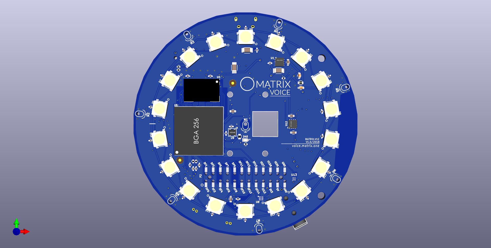
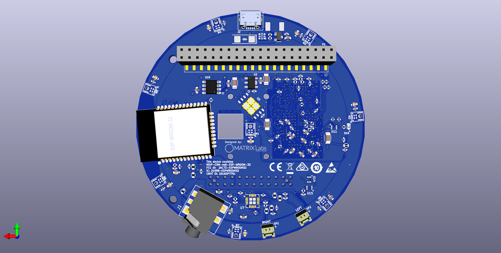
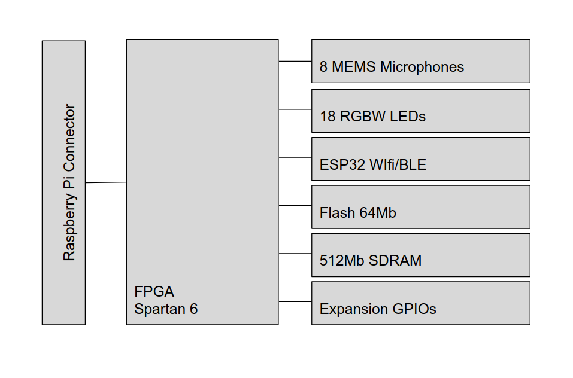

# MATRIX Voice

MATRIX Voice is an open-source VOICE RECOGNITION platform consisting of a 3.14-inches in diameter dev board, with a radial array of 8 MEMS microphones connected to a Xilinx Spartan 6 FPGA & 64 Mbit Flash, a 512Mbit SDRAM and 18 RGBW LED’s.

## Top View

## Bottom View

## System Architecture

## Voice Engine Integrations

- [Alexa](../examples/alexa.md)

## Technical Datasheets

- [Xilinx Spartan 6 FPGA - XC6SLX9-2FTG256C](http://www.xilinx.com/support/documentation/data_sheets/ds160.pdf)
- [8 MEMS audio sensor digital microphones - MP34DB02](http://www.st.com/content/ccc/resource/technical/document/datasheet/57/af/88/31/7b/59/4f/77/DM00111225.pdf/files/DM00111225.pdf/jcr:content/translations/en.DM00111225.pdf)
- [Serial Flash 64MBIT - MX25L6406E](http://www.macronix.com/Lists/Datasheet/Attachments/6681/MX25L6406E,%203V,%2064Mb,%20v1.9.pdf)
- [DDR2 SDRAM 512MBIT - MT47H32M16](http://www.micron.com/~/media/Documents/Products/Data%20Sheet/DRAM/DDR2/512MbDDR2.pdf)
- [3W Stereo Class-D Audio Amplifier and Class-AB Headphone Driver - PAM8019](https://www.diodes.com/assets/Datasheets/PAM8019.pdf)
- [RGBW LED - SK6812RGBW](http://blinkinlabs.com/wp-content/uploads/2016/01/SK6812RGBW-datasheet.pdf)
- [ESP32-WROOM](http://espressif.com/sites/default/files/documentation/esp-wroom-32_datasheet_en.pdf)
