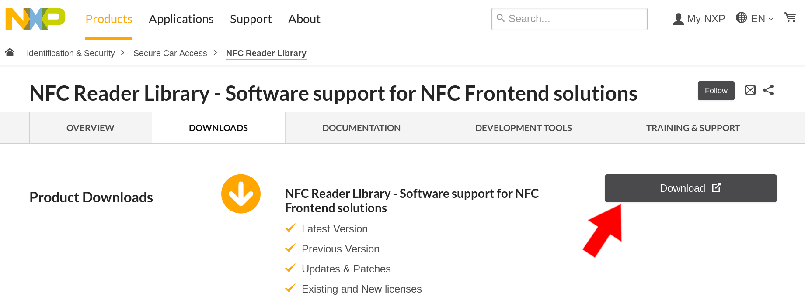
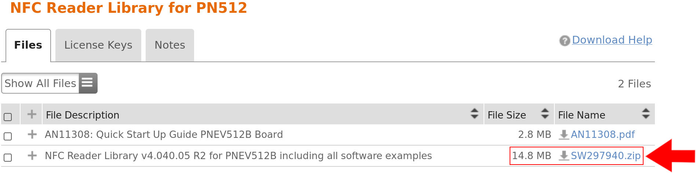

## Installing MATRIX HAL NFC

### Device Compatibility


> Make sure you have installed [MATRIX HAL](/matrix-hal/getting-started/) before continuing.

### Downloading the NXP Library

> Due to NXP's terms & conditions, we cannot directly distribute the library to our users.

You can download the **NFC Reader Library for PN512** by creating an account on the NXP website and downloading the zip file [**here**](https://www.nxp.com/products/identification-security/secure-car-access/nfc-reader-library-software-support-for-nfc-frontend-solutions:NFC-READER-LIBRARY?tab=In-Depth_Tab#nogo).

Click the download button.



Click the `4.04.05 NFC Reader Library for PN512`.


Then click `SW297940.zip` to download `NFC Reader Library v4.040.05 R2 for PNEV512B including all software examples`.



### Compiling and Installing MATRIX HAL NFC

Before starting, ensure you have access to the terminal of your Raspberry Pi via an <a href="https://www.raspberrypi.org/documentation/remote-access/ssh/" target="_blank">SSH-session</a> or connect a screen, mouse, and keyboard. Once you've opened the terminal, insert and run the following commands.

Install the tools needed to build MATRIX HAL NFC

```bash
sudo apt-get install cmake g++ git
```

Clone the MATRIX HAL NFC repository.

```bash
git clone https://github.com/matrix-io/matrix-hal-nfc.git
cd matrix-hal-nfc
```

Now move the `SW297940.zip` file you downloaded into the `matrix-hal-nfc` folder. If you don't know how to transfer files into your Raspberry Pi, follow this [simple guide on using an FTP client](https://www.techmuzz.com/how-to/raspberrypi/transfer-files-raspberry-pi-computer/).

Once complete, you can install the NXP library into `/usr/local/include/matrix_nfc/nxp_nfc` with the following command. Please ensure that you have have placed `SW297940.zip` inside `matrix-hal-nfc`.

```bash
./install_nxp.sh
```

Now build and install MATRIX HAL NFC with the following command.

```bash
./build.sh
```

## NFC Examples & Compile Instructions

After building is complete, a few compiled examples will be in the `build/examples` folder.

You can compile your own programs with the following command.
```bash
g++ -o YOUR_OUTPUT YOUR_INPUT -std=c++11 -DNXPBUILD__PH_RASPBERRY_PI -I/usr/local/include/matrix_nfc/nxp_nfc/NxpNfcRdLib/types -I/usr/local/include/matrix_nfc/nxp_nfc/NxpNfcRdLib/intfs -lmatrix_hal_nfc -lmatrix_creator_hal
```

## Helpful Information

MATRIX HAL NFC header files are installed in `/usr/local/include/matrix_nfc`. 

The compiled MATRIX HAL NFC library file is installed in `/usr/local/lib/libmatrix_hal_nfc.so`.

## Next Steps

Now that MATRIX HAL NFC is properly installed, you can find examples [here](../examples/nfc) and references [here](../reference/nfc).