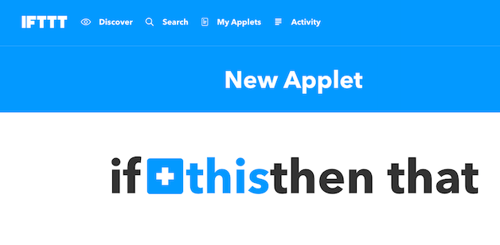

Here we will demonstrate a simple IFTTT integration to alert you to weather outside.

> You should know the basics of application creation and deployment. See [Application Workflow Example](app-create.md) for more information.


### IFTTT Setup
First, get an account at <http://ifttt.com>.

* Click on the profile menu on the right and select `New Applet` and click on `this`



* Select the Weather Underground Icon


* Select `Current Condition Changes To`


* Select Rain from the Dropdown


* Select `that`


* Type in and select `matrix-io`


* Connect with matrix-os


* Login with your MATRIX Credentials


* Allow IFTTT access to your MATRIX account

 

* Choose `Send a MATRIX Event` action


* Fill out details for your event. We are selecting to use an event named `weather-change` and passing the `Condition` (which should be "Rain").


* Finish making your applet.


### MOS Application Code

* Create the application
```
$ matrix create rain-oracle
$ cd rain-oracle

# first we setup the config
$ vi config.yaml
```

* Add to the `config.yaml`
```
integrations:
  - ifttt

events: 
  - weather-change
```

* Create `app.js`
```
matrix.on('weather-change', (condition) => {
  if ( condition === 'Rain'){
    matrix.led('blue').render();  
  }
})
```

* Deploy to device and start (ensure device is selected with `matrix use`)
```
$ matrix deploy

# start application
$ matrix start rain-oracle
```