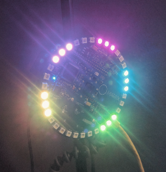

## Hello World

After you have successfully configured your MATRIX OS installation on a MATRIX device, you can install applications.

### Application Installation
Using the mobile application, or using the [Command Line Tool](../overview/cli.md), install `sensorTest`

```
> matrix install sensorTest
```

Allow access for the application to all sensors.

### Running an Application
Using the mobile application, flick the switch next to an application name to start.

Or if using the Command Line Tool

```
# after selecting device with `matrix use`
> matrix start sensorTest
```

### Success
You should see lights animating on the Everloop, one for every active sensor.



### Next Steps
Now that you have installed and run an application, [Next Steps](next-steps.md) will be able to guide your next MATRIX adventure.