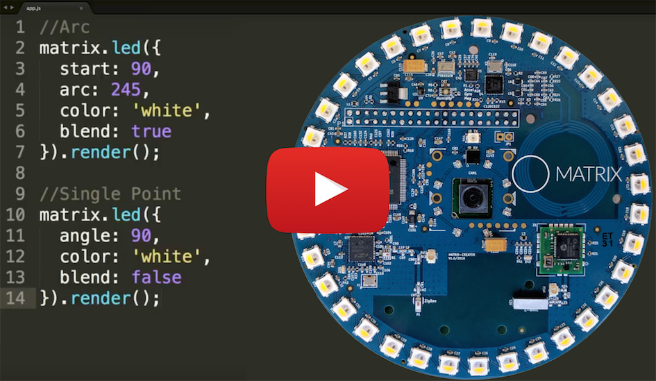

<h2 style="padding-top:0>Everloop LEDs</h2>

### Device Compatibility


The Everloop is a powerful tool for visually communicating through LEDs. Click the video below to learn more.

[](https://www.youtube.com/watch?v=L4btaqw4HqM)
> `matrix.darken()` and `matrix.brighten()` have not been implemented.

## String Notation & Render
You can use any CSS color property (color-name, rgb, and hex). Darker colors on the Everloop generally display with more precision then lighter colors, which tend to get washed out. The code below shows how to set the entire Everloop to green with each CSS property.
> The `.render()` method must be included at the end of the `matrix.led()` method to update your MATRIX device's LEDs.
```language-javascript
// String
matrix.led('green').render();
// Hexadecimal
matrix.led('#00ff00').render();
// RGB
matrix.led('rgb(0,255,0)').render();
```
> Please avoid using `rgba`. Alpha values do not render correctly.

## Creating Shapes
> Currently, shape manipulation on the MATRIX Voice does not render properly. Fix in progress!

Shape objects are methods of manipulating multiple LEDs in the Everloop at once.  Shape creation is simple, you define the shape you want to make as an object and pass it into `matrix.led()` like the example below

```language-javascript
matrix.led({
  arc: 90, //arc shape that takes up 90° of Everloop 
  color: green, //turn shape green
  start: 0 //start shape at 0° of Everloop
}).render();
```

<h3 style="padding-top:0">Available Shapes</h3>
Include one of these `shape` properties in your shape.
```
arc: 90 //number of degrees to draw an arc, supports negative values
angle: 45 //degree number to draw a single point
```

<h3 style="padding-top:0">Shape Properties</h3>
Every Shape object must include the `color` property to render.
```
color: 'red' //color strings, as specified above
spin: 230 //rotate color hue ( 0 - 360 )
start: 0  //degree at which shape begins, arc shape only
```

<h3 style="padding-top:0">Rotation Operation</h3>
These operate on the shapes and colors defined in the `led` object.

```language-javascript
.rotate(angle); //rotates whole shape by number of degrees 
```
```language-javascript
matrix.led({
    arc: 45,
    color: 'blue',
    start: 50
}).rotate(90).render();
```

<h3 style="padding-top:0">Multiple Shapes</h3>
Use an array in the `matrix.led()` method to include multiple shapes.
```language-javascript
// make a smiley face
matrix.led([
  //left eye angle
  {
    angle: 45,
    color: 'yellow'
  },
  //right eye angle
  {
    angle: 135,
    color: 'yellow'
  },
  //smile arc
  {
    arc: 90,
    color: 'yellow',
    start: 225
  }
]).render();
```

<h3 style="padding-top:0">Direct LED Manipulation</h3>
Array index indicates the LED to change. The index of an LED is labeled directly above the LED on your MATRIX device (D1, D2, D3, D4, etc..). Use 0 to turn off the LED.
```language-javascript
matrix.led([0, 0, 0, 0, 'yellow', 0,
0, 0, 0, 0, 0, 0, 0, 'yellow', 0, 0,
0, 0, 0, 0, 0, 0, 'yellow', 'yellow',
'yellow', 'yellow', 'yellow', 'yellow',
'yellow', 'yellow', 'yellow']).render();
```


## LED Animation
By using a `setInterval()` method, you can animate the LEDs on the Everloop. Below is an example of an active clock that demonstrates this. 
```language-javascript
setInterval(function(){
  var time = new Date();
  var h = time.getHours();
  var m = time.getMinutes();
  var s = time.getSeconds();

  var hourLED = {
    // translate hours (12) to angle (360)
    arc: h * 3,
    color: 'blue'
  };

  var minuteLED = {
    // translate minutes ( 60 ) to angle ( 360 )
    angle: m * 6,
    color: 'green'
  };

  var secondLED = {
    // translate seconds (60) to angle (360)
    angle: s * 6,
    color: 'yellow',
  };

  // will draw all three
  matrix.led([hourLED, minuteLED, secondLED]).render();

}, 1000);
```

## Advanced Use
Enable `SUN_MODE=true` as a flag, when launching MATRIX OS, to turn on the white LEDs (and the luminence calculations). Wear sunglasses or use another mode of protecting your eyes when using this while developing. It is intended for use behind coverings.

```language-bash
SUN_MODE=true node index
```