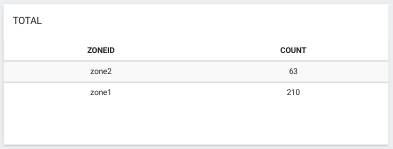

## Widgets

Defined in config.yaml, widgets display information from the device and allow you to send information via familiar interfaces, like dropdowns and buttons.

### Layout
For details on how to arrange widgets on a dashboard, see [screens](dashboard/#screens)

Widgets are basically configuration objects which can be defined with the following options. 

#### Options

##### All Widgets
* `label` - text label for this widget box

Widgets come in two forms:
* Display Widgets - Displays data from an application
* Interactive Widgets - Sends real-time events to an application

##### Display Widget Options
Display widgets, like tables, charts and value outputs are only concerned with what data to display and how to display it.
* `display` - which display widget to load
* `key`/`keys` - show these keys from the data payload
* `type` - select keys from this data segment (see [Overview > Sending Data](data-types.md) )
* `format` - filter the data. choose from `count`, `sum`, `avg`, `percent`, `max`, `min`, `fixed`, `round`.
* `realtime` - defaults to true. set to false and use refresh option for manual updates.
* `refresh` - how many seconds between data refresh. not set by default. use with realtime: false. 

##### Interactive Widget Options
* `control` - which interactive widget to load
* `trigger` - the event to listen for in your application ( see [Reference > Crosstalk](crosstalk.md))
* `value` - on button widgets, what text should be in the button
* `map` - on button widgets, a collection of `value: trigger` where value is the button text, and trigger is the event fired

#### Data Operations

Using `format`, data operations can be applied to the data for each Display Widget. The current widget configuration supports the operations: `count`, `sum`, `avg`, `percent`, `max`, `min`, `fixed`, `round`.

#### Data Handling
The dashboard holds a central data store which the widgets receive or request data from.

Default operation is for a widget to be updated with data in real time. This is represented by enabling the option `realtime`:

```language-yaml
// To enable realtime updates
widgets:
  testWidget:
     realtime: true
```

The alternative is to have a widget manually refresh it's data on an interval by disabling `realtime`. Default `refresh` is 5 seconds. If you wanted to refresh a graph every minute:

```language-yaml
// To disable realtime updates
widgets:
  testWidget:
     realtime: false
     refresh: 60
```

#### Widget Size

Widgets can be resized horizontally with the `size` attribute.

Size is simply the percentage width you would like the widget to take. If size is not specified, then the widget will take up a equal proportion of the remaining width.

##### Example
```language-yaml
widgets:
  halfWidth:
    size: 50
  quarterWidth:
    size: 25
    # size doesn't need to be specified
  quarterWidth2:
    # size doesn't need to be specified
```

#### Display widgets
Indicated via a `display` option.

```language-yaml
widgets:
  barChart:
    display: bar
```

`bar` - bar chart

`digit` - numerical

`radar` - radar chart

`line` - line chart

`list` - data table

`list-group` - grouped data table

`pie-chart` - pie chart

`polar` - polar area chart

`label` - string display

`gauge` - gauge

`indicator` -  light indicator on/off

`map` - map

`link` - link to a destination (URL)

## Interactive Widgets
Indicated via a `control` option.

```language-yaml
widgets:
  controlButton:
    control: button
```

`input` - input field, single or multiple

`button` - button, single or multiple

`switch` - switch, single or multiple

`radio` - radio, single or multiple

`dropdown` - dropdown menu

`range` - range slider

`xy` - track pad

`radial` - joystick, single or multiple

`color` - color picker


# Widget Examples

# Displays

## Digit

```language-yaml
digitTest:
  display: digit
  type: monitor
  key: cpu
  format: round
  label: cpu
```

###### Handling Code
```language-javascript
matrix.type('monitor').send({
  'cpu': 2.4,
  'memory': 5.4 }
);  
```

## Label

```language-yaml
labelTest:
  display: label
  type: uv
  key: risk
  label: UV Risk
```

###### Handling Code
```language-javascript
matrix.type('uv').send({
  'value': 0.56773,
  'risk': 'Low' }
);  
```

## Bar Chart

```language-yaml
barChartTest:
  display: bar
  type: monitor
  keys: cpu, memory
  format: avg
  realtime: false
  refresh: 60
  label: Bar Chart
```

###### Handling Code
```language-javascript
matrix.type('monitor').send({
  'cpu': 7.03,
  'memory': 2.30 }
);  
```

## Line Chart

```language-yaml
lineChartTest:
  display: line
  type: monitor
  format: avg
  keys: cpu, memory
  realtime: true
  label: Line Chart
```

###### Handling Code
```language-javascript
matrix.type('monitor').send({
  'cpu': 7.03,
  'memory': 2.30 }
);  
```

## Radar Chart

```language-yaml
radarTest:
  display: radar
  type: emotions
  keys: happy,sad,disgust,surprised,confused,calm,angry
  label: Emotions
```

###### Handling Code
```language-javascript
matrix.type('emotions').send({
  'happy': 67,
  'sad': 50,
  'disgust': 78,
  'surprised': 56,
  'confused': 86,
  'calm': 70,
  'angry': 60 }
);  
```

## Pie Chart

```language-yaml
pieChartTest:
  display: pie-chart
  type: gender
  keys: women,men
  label: Gender
```

###### Handling Code
```language-javascript
matrix.type('gender').send({
  'women': 76,
  'men': 45 }
);  
```

## Polar Chart

```language-yaml
polarTest:
  display: polar
  type: emotions
  keys: happy,sad,disgust,surprised,confused,calm,angry
  label: Emotions
```

###### Handling Code
```language-javascript
matrix.type('emotions').send({
  'happy': 67,
  'sad': 50,
  'disgust': 78,
  'surprised': 56,
  'confused': 86,
  'calm': 70,
  'angry': 60 }
);  
```

## Gauge

```language-yaml
gaugeTest:
  display: gauge
  type: detection
  keys: views
  min: 0
  max: 100
  label: 'Views'
```

###### Handling Code
```language-javascript
matrix.type('detection').send({
  'views': 60,
  'impressions': 100 }
);  
```

## Indicator

```language-yaml
indicatorTest:
  display: indicator
  type: system
  keys: isOn
  label: 'Indicator Test'
```

###### Handling Code
```language-javascript
matrix.type('system').send({
  'isOn': true}
);  
```

## Map

```language-yaml
mapTest:
  display: map
  type: location
  label: 'Map Test'
```

###### Handling Code
```language-javascript
matrix.type('location').send({
  'latitude': 25.791632,
  'longitude': -80.1414447,
  'label': 'AdMobilize'}
);  
```

## Lists

```language-yaml
listTest:
  display: list
  type: device
  keys: Hostname,Type,Platform,Arch
  label: Secret Information
```

###### Handling Code
```language-javascript
matrix.type('device').send({
  'Hostname': 'h7n.domain',
  'Type': 'Darwin',
  'Platform': 'darwin',
  'Arch': 'x64'}
);  
```

## List Group

### Simple Group

```language-yaml
info:
  display: list-group
  type: vehicleDetection
  keys: count
  format: count
  label: Total
```

###### Handling Code
```language-javascript
matrix.type('vehicleDetection').send({
  'zoneId': 'zone1',
  'count': '4',
  'speed': '56'}
);  
```

### Group by Key

```language-yaml
info:
  display: list-group
  type: device
  keys: zone, count
  format: count
  groupby: zone
  label: Total
```

###### Handling Code
```language-javascript
matrix.type('vehicleDetection').send({
  'zoneId': 'zone1',
  'count': '4',
  'speed': '56'}
);  
```

## Links

```language-yaml
link:
  display: link
  label: "Link display"
  title: "Google"
  url: "https://www.google.com"
```

# Interactive (Controls)

## Input
### Single


```language-yaml
  inputTest:
    control: input
    event: testInput
    value: 'type text'
    label: 'Test Input'
```

###### Handling Code
```language-javascript
matrix.on('testInput', function(p){
 var text = p.value;
})
```

### Multiple


```language-yaml
  inputMapTest:
    control: input
    map:
      - event: testInput1
        value: first type text
      - event: testInput2
        value: second type text
    label: Test Input Map
```

###### Handling Code
```language-javscript
matrix.on('testInput1', function(p){
 var text = p.value;
})

matrix.on('testInput2', function(p){
 var text = p.value;
})

```

## Buttons

### Single


```language-yaml
  buttonTest:
    control: button
    event: buttonInfo
    value: Get Secret Information
    label: Hacking Buttons
```

###### Handling Code
```language-javascript
matrix.on('buttonInfo', function(){
  // ...
})
```

### Multiple


```language-yaml
  buttonMapTest:
    control: button
    map:
      - event: buttonUp
        value: amps+
      - event: buttonDown
        value: amps-
      - event: buttonStart
        value: begin
      - event: buttonStop
        value: end
      - event: buttonCapture
        value: capture
      - event: buttonSlow
        value: refresh+
      - event: buttonFast
        value: refresh-
    label: Matrix Activation Buttons
```

###### Handling Code
```language-javascript
matrix.on('buttonUp', function(){
  // ...
})

matrix.on('buttonDown', function(){
  // ...
})

matrix.on('buttonStart', function(){
  // ...
})

matrix.on('buttonStop', function(){
  // ...
})

matrix.on('buttonCapture', function(){
  // ...
})

matrix.on('buttonSlow', function(){
  // ...
})

matrix.on('buttonFast', function(){
  // ...
})
```

## Switch

### Single

```language-yaml
  switchTest:
    control: switch
    event: ledEnabledChanged
    value: Leds enabled
    label: Switch Test
```

###### Handling Code
```language-javascript
matrix.on('ledEnabledChanged', function(p){
 var isOn = p.value;
})
```

### Multiple

```language-yaml
  switchMapTest:
    control: switch
    map:
      - event: ledEnabledChanged
        value: Leds enabled
      - event: detectionEnabledChanged
        value: Detection Enabled
    label: Switch Map Test
```

###### Handling Code
```language-javascript
matrix.on('ledEnabledChanged', function(p){
 var isOn = p.value;
})

matrix.on('detectionEnabledChanged', function(p){
 var isOn = p.value;
})
```

## Radio

```language-yaml
  radioTest:
    control: radio
    map:
      - event: optionOneSelected
        value: Option One
      - event: optionTwoSelected
        value: Option Two
    label: Radio Test
```

###### Handling Code
```language-javascript
matrix.on('optionOneSelected', function(p){
  // ...
})

matrix.on('optionTwoSelected', function(p){
  // ...
})
```

## Drop Downs

```language-yaml
  dropDownTest:
    control: dropdown
    map:
      - event: optionOneSelected
        value: Option One
      - event: optionTwoSelected
        value: Option Two
    label: Dropdown Test
```

###### Handling Code
```language-javascript
matrix.on('optionOneSelected', function(){
 //...
})

matrix.on('optionTwoSelected', function(){
 //...
})
```

## Range

```language-yaml
  rangeTest:
    control: range
    event: rangeChanged
    min: 0
    max: 35
    label: Range Test
```

###### Handling Code
```language-javascript
matrix.on('rangeChanged', function(p){
 var value = p.value;
})
```

## XY

```language-yaml
  xyTest:
    control: xy
    event: xyChanging
    value: 'xy'
    xMax: 100
    yMax: 50
    label: Test XY
```

###### Handling Code
```language-javascript
matrix.on('xyChanging', function(p){
 var x = p.value.x;
 var y = p.value.y;
})
```

## Radial
### Single


```language-yaml
  radial:
    control: radial
    event: radialChanging
    label: Radial Test
```

###### Handling Code
```language-javascript
matrix.on('radialChanging', function(p){
 var x = p.value.x; //from -1 to 1
 var y = p.value.y; //from -1 to 1
})
```

### Multiple


```language-yaml
  radialMap:
    control: radial
    map:
    - event: radialRChanging
      value: right
    - event: radialLChanging
      value: left
    label: Radial Map Test
```

###### Handling Code
```language-javascript
matrix.on('radialRChanging', function(p){
 var x = p.value.x; //from -1 to 1
 var y = p.value.y; //from -1 to 1
})

matrix.on('radialLChanging', function(p){
 var x = p.value.x; //from -1 to 1
 var y = p.value.y; //from -1 to 1
})
```

## Color
  
```language-yaml
  color:
    control: color
    event: colorChange
    value: 'color'
    label: 'Change MATRIX color'
```

###### Handling Code
```language-javascript
matrix.on('colorChange', function(color){
  color = color.value;
  matrix.led(color).render();
});
```

# Responsive Data Flow
```language-javascript
matrix.on('buttonInfo', function(){
  matrix.type('device').send({
    'os_hostname': os.hostname(),
    'os_type': os.type(),
    'os_platform': os.platform(),
    'os_arch': os.arch()
  });
})
```
When `buttonInfo` is triggered, respond with information with a type `device`.

The list looks for
```language-yaml
widgets:
  list:
    type: device
```
The `list` widget displays information of type `device`.
