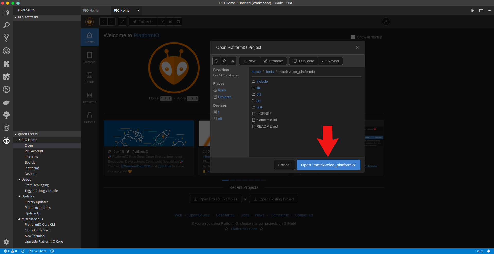
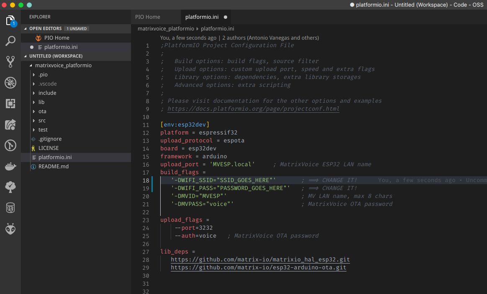
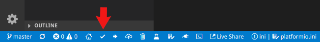

## ESP32 Setup
This guide will show you how to get started with the ESP32 module on the MATRIX Voice ESP32 version.

<br>

## Step 1: Raspberry Pi Setup

Run the following commands inside your Raspberry Pi terminal to install the MATRIX Voice Software. This will keep the FPGA firmware updated and install a few tools to flash the ESP-WROOM-32.

Add the MATRIX repository and key.
```bash
curl https://apt.matrix.one/doc/apt-key.gpg | sudo apt-key add -
echo "deb https://apt.matrix.one/raspbian $(lsb_release -sc) main" | sudo tee /etc/apt/sources.list.d/matrixlabs.list
```

Update your repository and packages.
```bash
sudo apt-get update
sudo apt-get upgrade
```

Install the MATRIX init package.
```bash
sudo apt install matrixio-creator-init
```

Reboot your Raspberry Pi.
```bash
sudo reboot
```

SSH back into your Raspberry Pi and enable the ESP32 communications.
```bash
sudo voice_esp32_enable
```

Reset the ESP32 flash memory.
```bash
esptool.py --chip esp32 --port /dev/ttyS0 --baud 115200 --before default_reset --after hard_reset erase_flash
```

Reboot your Raspberry Pi.
```bash
sudo reboot
```

<br>

## Step 2: Personal Computer Setup

Here we're installing the requirements needed to allow your PC to develop and compile ESP32 projects.

First install git from <a href="https://git-scm.com/downloads" target="_blank">https://git-scm.com/downloads</a>.

Next install Visual Studio Code and PlatformIO.

PlatformIO is an open source ecosystem for IoT development that is installed with a Visual Studio Code extension.

You can install the Visual Studio Code text editor [here](https://code.visualstudio.com/docs/introvideos/basics) and the PlatformIO extension [here](https://platformio.org/). PlatformIO also has support for the Atom text editor.

PlatformIO comes preinstalled with Espressif IDF, the library necessary to develop on the ESP32.
Once you have downloaded and installed the above items, run the following command to clone the PlatformIO project.

```bash
git clone https://github.com/matrix-io/matrixvoice_platformio
```

<br>

## Step 3: Set up WiFi parameters for OTA (Over The Air) deployment

Open Visual Studio Code and open the PlatformIO home hub. 


Click on `Open Project` and select the `matrixvoice_platformio` folder. 



Once inside the `matrixvoice_platformio` folder open `platformio.ini`.

The example code in the initial src/main.cpp file uses OTA updates to easily redeploy code to the ESP32.

To enable OTA updates, make sure to change the "SSID_GOES_HERE" and "PASSWORD_GOES_HERE" to your actual WiFi SSID and password.



<br>

## Step 4: Build and Deploy

To compile the code, click on the button with the check mark on the bottom left corner of Visual Studio Code. This will build and compile the code to `.pio/build/lolin32/firmware.bin` in the `matrixvoice_platformio` directory.

Alternatively you can run `pio run` while in the `matrixvoice_platformio` directory.



To deploy the firmware change into the `matrixvoice_platformio/ota` directory and run `install.sh`. Replace `YOUR_PI_IP_HERE` with the IP of your Raspberry Pi.

```bash
cd ota
./install.sh YOUR_PI_IP_HERE
```

<br>

## Deploying after initial install

After the initial upload, all successive uploads can be done through OTA or through the `install.sh` script above. 
To upload using OTA, open a terminal, go into the project directory, and run this command.

```bash
pio run --target upload
```

<br>

## Finishing Up

Your MATRIX Voice ESP32 should now be running the deployed example. With the program properly flashed in the ESP32, the Voice can now run without the Pi if you choose to do so. Ensure the MATRIX Voice and Pi are not powered before connecting or disconnecting.
