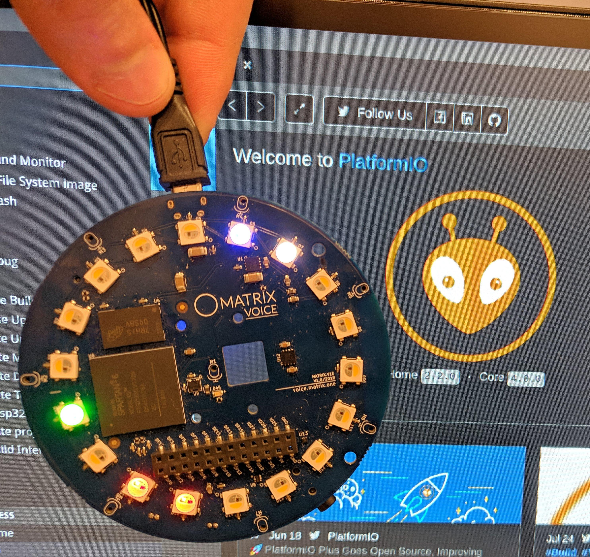
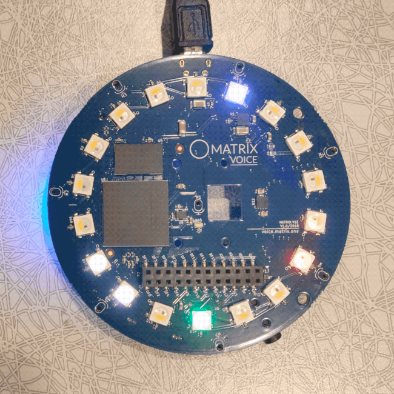

## ESP32 Setup

This guide will show you how to program the Matrix Voice's ESP32 with Visual Studio Code using PlatformIO, an open source ecosystem for IoT development.



<br>

## Step 1: Raspberry Pi Setup

Run the following commands inside your Raspberry Pi terminal to install the MATRIX Voice Software. This will keep the FPGA firmware updated and install a few tools to flash the ESP-WROOM-32.

Add the MATRIX repository and key.
```bash
curl https://apt.matrix.one/doc/apt-key.gpg | sudo apt-key add -
echo "deb https://apt.matrix.one/raspbian $(lsb_release -sc) main" | sudo tee /etc/apt/sources.list.d/matrixlabs.list
```

Update your repository and packages.
```bash
sudo apt-get update
sudo apt-get upgrade
```

Install the MATRIX init package.
```bash
sudo apt install matrixio-creator-init
```

Reboot your Raspberry Pi.
```bash
sudo reboot
```

SSH back into your Raspberry Pi and enable the ESP32 communications.
```bash
sudo voice_esp32_enable
```

Reset the ESP32 flash memory.
```bash
esptool.py --chip esp32 --port /dev/ttyS0 --baud 115200 --before default_reset --after hard_reset erase_flash
```

<br>

## Step 2: Personal Computer Setup

Here we're installing the requirements needed to allow your PC to develop and compile ESP32 projects.

* [Git](https://git-scm.com/downloads) : Version control tool.
* [Visual Studio Code](https://code.visualstudio.com/) : Powerful text editor.
* [PlatformIO](https://platformio.org/) : Development ecosystem with Espressif IDF preinstalled.
* [Add PlatformIO to your PATH](https://docs.platformio.org/en/latest/installation.html#install-shell-commands).

Once you have completed the above items, run the following command to clone the PlatformIO project.

```bash
git clone https://github.com/matrix-io/esp32-platformio
```

<br>

## Step 3: Configure OTA (Over The Air) Deployment

Open Visual Studio Code and open the PlatformIO home hub. 


Click on `Open Project` and select the `esp32-platformio` folder. 


Once inside the `esp32-platformio` folder open `platformio.ini`.

The example code in the initial `src/main.cpp` file uses OTA updates to easily redeploy code to the ESP32.

To enable OTA updates, make sure to change the `SSID_GOES_HERE` and `PASSWORD_GOES_HERE` to your actual WiFi SSID and password.


???+ bug "For Windows Users"

    If you are using Windows, replace the `upload_port` parameter inside `platformio.ini` with the IP of your MATRIX VOICE ESP32.

    For example, if your IP is `192.168.1.1` then change
    ```
    upload_port = 'MVESP.local'
    ```
    to
    ```
    upload_port = 192.168.1.1
    ```

<br>

## Step 4: Initial Build and Deploy

To compile the code, click on the button with the check mark on the bottom left corner of Visual Studio Code. This will build and compile the code to `.pio/build/lolin32/firmware.bin` in the `esp32-platformio` directory.

!!! tip "Alternatively you can use the `pio run` command while in the `esp32-platformio` directory."


To deploy the compiled firmware run the commands below. Replace `YOUR_PI_IP_HERE` with the IP of your Raspberry Pi. If you are running Windows please use `Git Bash` as your terminal for the following commands.

```bash
cd esp32-platformio/ota
./install.sh YOUR_PI_IP_HERE
```

<br>

## Step 5: Deploying After Initial Upload

After the initial upload, all successive uploads can be done through OTA or through the `install.sh` script above. 
To upload using OTA, open a terminal, go into the project directory, and run this command.

```bash
pio run --target upload
```

<br>

## Finishing Up



Your MATRIX Voice ESP32 should now be running the deployed example shown above. With the program properly flashed in the ESP32, the Voice can now run without the Pi if you choose to do so. Ensure the MATRIX Voice and Pi are not powered before connecting or disconnecting.

The deployed code can be found in the `src/main.cpp` file inside the `esp32-platformio` directory.

More examples can be found [here](https://github.com/matrix-io/matrixio_hal_esp32/tree/master/examples).

<br>

## Helpful Information

??? info "Updating PlatformIO Libraries"

    To update PlatformIO and PlatformIO libraries run the following commands.

    ```bash
    pio update
    pio lib update
    ```

??? info "Connecting to the ESP32 UART from Raspberry Pi"

    To read the serial output from the ESP32 using `minicom` the MATRIX VOICE ESP32 must be connected to the Pi.

    First install `minicom` on your Raspberry Pi.

    ```bash
    sudo apt install minicom
    ```

    Then to connect and read from serial run the following command.

    ```bash
    sudo minicom -D /dev/ttyS0
    ```

    To close minicom press `Ctrl+A` then `X`.

<br>

## Troubleshooting

If the `pio run --target upload` command does not work please check the `MVID` parameter inside `platformio.ini`, it should have a maximum length of 8 characters. 

If `pio run --target upload` still does not work try running the below command instead, replacing `'MVESP.local'` with the data from the `upload_port` parameter inside `platformio.ini`.

```bash
~/.platformio/packages/framework-arduinoespressif32/tools/espota.py --port=3232 --auth=voice --debug --progress -i 'MVESP.local' -f .pio/build/esp32dev/firmware.bin
```

If you encounter issues with building try removing build files, reinstalling libraries, and rebuilding project with the following commands.

```bash
pio run -t clean && rm -r .pio
pio run
```
