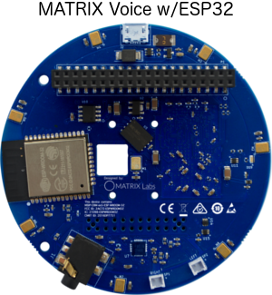

## MATRIX Voice

The MATRIX Voice is a development board for building sound driven behaviors and interfaces. MATRIX Voice was built with a mission to give every maker, tinkerer, and developer around the world a complete, affordable, and user-friendly tool for simple to complex Internet of Things (IoT) voice app creation.

## Overview

<h4 style="padding-top:0"><a href="../device-setup">Device Setup</a></h4>
How to get started with your MATRIX Voice & MATRIX Voice ESP32 version

<h4 style="padding-top:0"><a href="../esp32">ESP32</a></h4>
Instructions to setup your ESP32 module

<h4 style="padding-top:0"><a href="../resources/overview">Resources</a></h4>
View and download helpful information about the MATRIX Voice

## Board Versions

Both versions of these boards run the same on a Raspberry Pi, however, the MATRIX Voice ESP32 version has the option to run standalone by programming the ESP32 module.

 