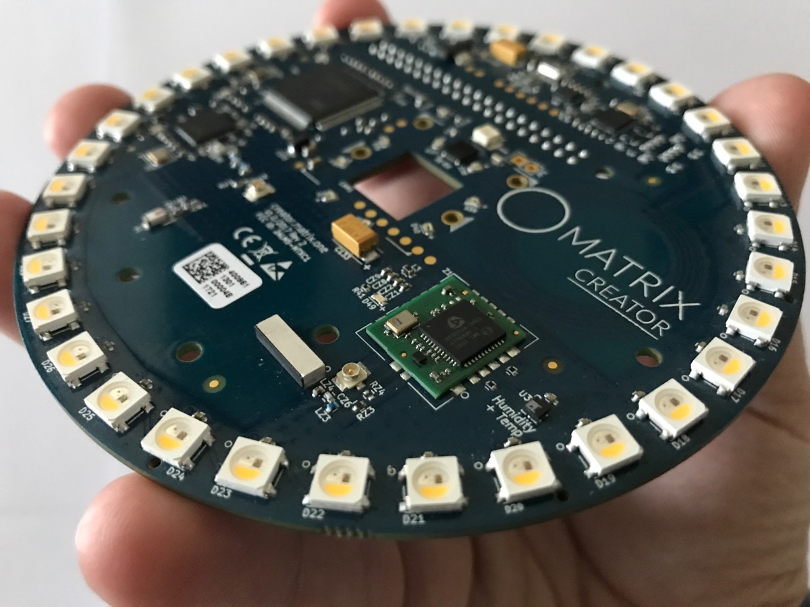
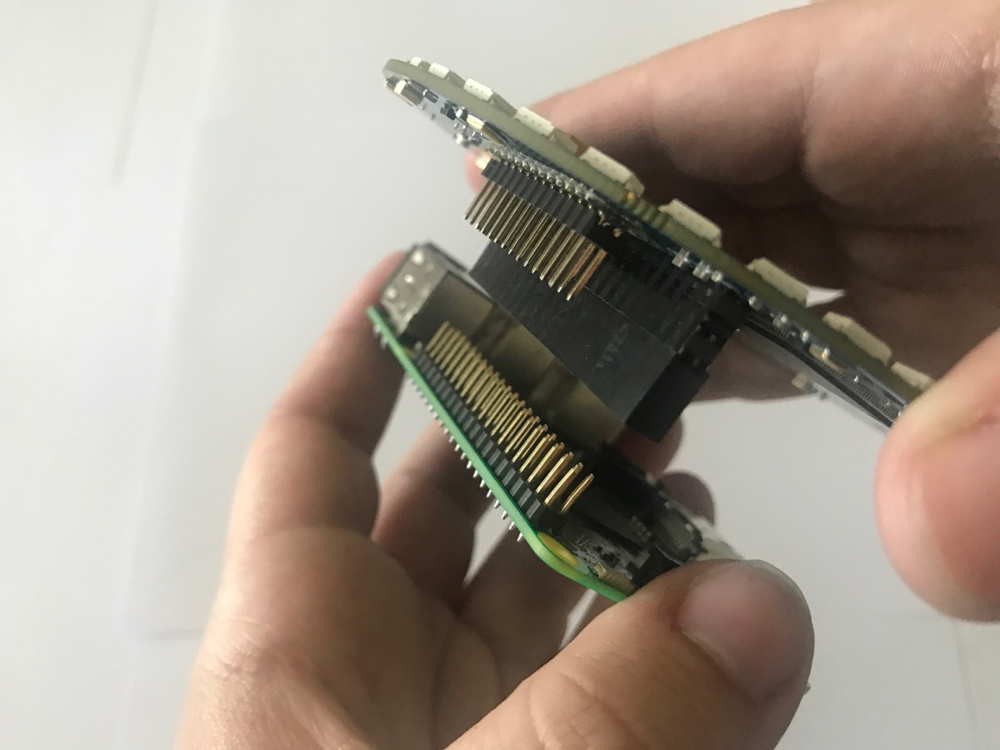

# Device Setup

Congratulations on your purchase of a MATRIX device, we hope this is the beginning of an exciting adventure of making and discovery.

## Connecting your Device to a Pi

#### Your MATRIX device is made to fit atop a Raspberry Pi.

#### Align the MATRIX device pin slots to the GPIO pins on the Pi.

#### Press together firmly.

#### The center of the Pi should roughly align with the center of the MATRIX device.

## Power On

Connect at least 2.5A of power to your Raspberry Pi.

A small blue led (not on the ring) flashing once a second indicates that everything is ok on the MATRIX device.

If the LED ring lights up, this means [MATRIX OS](../matrix-os/) is installed and running. Once it shines blue, initiate [pairing](matrix-os/getting-started/pairing/) with your mobile phone.

## Next Steps
Where to go next with your MATRIX is entirely dependent on your level of comfort.

- [MATRIX OS](matrix-os/) - A fully managed platform for your devices, data and behaviors
- [MATRIX CORE](matrix-core/) - Centralized software protocol to enable communication with the hardware.
- [MATRIX HAL](matrix-hal/) - Reprogram your MATRIX device with FPGA and microcontroller tooling.