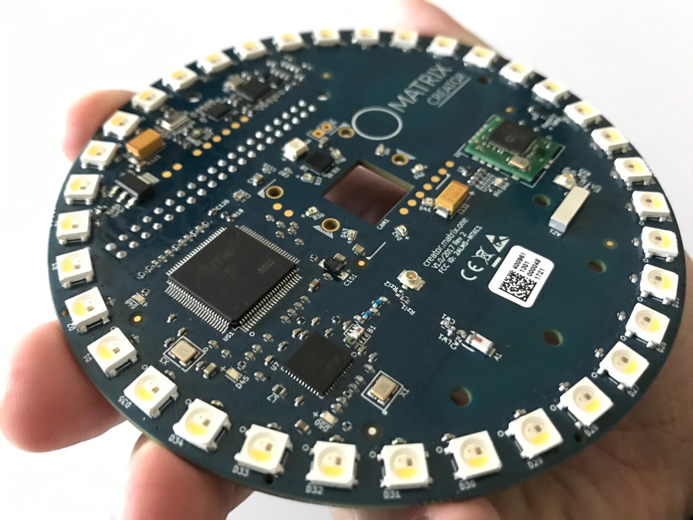

# Device Setup

Congratulations on your purchase of a MATRIX device, we hope this is the beginning of an exciting adventure of making and discovery.

### Connecting your Device to a Pi

##### Your MATRIX device is made to fit atop a Raspberry Pi.

> If you're using a Camera, be sure to connect it now.

##### Align the MATRIX device pin slots to the GPIO pins on the Pi.

##### Press together firmly.

#### The center of the Pi should roughly align with the center of the MATRIX device.

### Insert SD Card

Make sure you have a copy of Raspbian on that Micro SD Card of yours, and ensure that it's seated well in the SD Card slot.

### Power On

Connect at least 2.5A of power to your Raspberry Pi.

### Continue

Where to go next with your MATRIX is entirely dependent on your level of comfort.

- [MATRIX OS](matrix-os/) - A fully managed platform for your devices, data and behaviors, with the primary language being Javascript.
- [MATRIX CORE](matrix-core/) - Centralized software protocol to enable communication with the hardware, with 40+ languages supported.
- [MATRIX HAL](matrix-hal/) - C++ drivers for sensors and available components. Tooling for accessing the FPGA and microcontrollers on the MATRIX device.